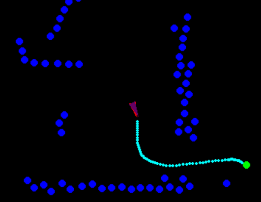

# Autonomous Drone Project

 

## Dependancies
For this project the CrazyFlie Library will need to be installed. 
The instructions for this can be found on the following page https://www.bitcraze.io/documentation/repository/crazyflie-clients-python/master/installation/install/

Additionally pyGame will need to be installed, which can be done by using the command \ "pip install pygame"

## Code
The codebase contains the following files.

### MotioncommanderTest.py
MotioncommanderTest.py contains a simple testing code which was taking from https://github.com/bitcraze/crazyflie-lib-python/tree/master/examples
It simply tests the hardware and runs a simple preset routine for the drone.

### AstarImplementation.py
This version uses an a star algorithm to plan a path for the drone. 
It contains a fully functioning GUI that presents the drones location relative to a pointcloud based on the multiranger data.
The user will be able to select a location on the screen and a* will be used to find the fastest path towards it.
The drone will then execute this path by being instructed to visit each node until it reaches the final node. 
When an the drone is close to an obstacle it avoids it and recalculates the path.
This version also contains a manual control mode.

### RRT-RRTStar-Test.py
A script that only contains the RRT Star Algorithm to test it and run it under different configurations, without actually activating the drone.
The algorithm was originally taken from https://gist.github.com/Fnjn/58e5eaa27a3dc004c3526ea82a92de80 , but adaptations were made to make the algorithm aproximately 15 times faster. 

### RRTstarImplementation.py

This is an improved version of the a* implementation. The following changes were made.

-RRT* was used to plan the path \
-The path is smoothed out \
-The drone follows the path forward facing as to detect objects in its line of motion \
-When the drone misses the next node in its path but is detected to have reached a later node, 
it deletes all nodes before this later node. \
-When the drone detects an object in proximity, it avoids it, 
and scans the environment before it recalculates the path. \

## Support
thomasevers9@gmail.com

## Contributing
Please feel free to improve this as future projects happen at the department.

## License
MIT-license.

## Project status
Not Active
